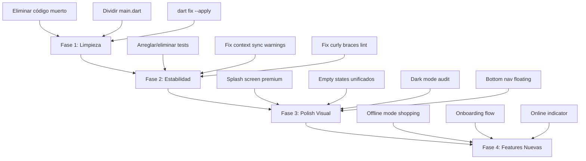

# 🔍 HomeSync Flutter — Auditoría Profunda (10 Marzo 2026)

## 📊 Estado General

| Métrica                              | Valor                                                                                                                                      |
| ------------------------------------ | ------------------------------------------------------------------------------------------------------------------------------------------ |
| **Features**                         | 11 (auth, dashboard, tasks, expenses, household, notifications, rewards, savings, settings, shopping, stats)                               |
| **Archivos Dart en `lib/`**          | ~100 (sin `.g.dart`)                                                                                                                       |
| **Líneas de código (main.dart)**     | 875                                                                                                                                        |
| **Dependencias**                     | 32 directas                                                                                                                                |
| **Tests**                            | 13 archivos (**⚠️ la mayoría ROTOS**)                                                                                                      |
| **Errores de análisis**              | 0 errores en `lib/`, ~50+ warnings (deprecated `withOpacity`, `use_build_context_synchronously`)                                           |
| **Tests con errores de compilación** | `models_test.dart`, `expense_e2e_test.dart`, `repositories_test.dart`, `usecases_test.dart`, `tasks_flow_test.dart`, `providers_test.dart` |

> [!IMPORTANT]
> La app **compila y corre** correctamente. No hay errores de compilación en `lib/`. Todos los errores duros están exclusivamente en **`test/`**, donde los tests quedaron desactualizados tras la migración a Clean Architecture.

---

## ✅ Lo que está MUY bien

### 1. Arquitectura Clean sólida

La estructura `features/` sigue un patrón consistente:

```
feature/
├── data/repositories/     → Implementación concreta (Supabase)
├── domain/
│   ├── models/            → Entidades de dominio
│   ├── repositories/      → Interfaces abstractas
│   └── usecases/          → Lógica de negocio aislada
└── presentation/
    ├── providers/         → Riverpod (AsyncNotifier)
    ├── screens/           → UI
    └── widgets/           → Componentes específicos del feature
```

### 2. Design System centralizado

- [app_colors.dart](file:///lib/core/theme/app_colors.dart) tiene 377 líneas de paleta, helpers de categorías, colores por tema.
- [app_theme.dart](file:///lib/core/theme/app_theme.dart) implementa `lightTheme` + `darkTheme` + `GlassContainer`.
- `AppAnimationsExtension` ofrece `.animateEntrance()`, `.animateStaggered()`, `.animateScaleIn()` como API fluida.

### 3. Error Handling bien pensado

- Pipeline dual: **Crashlytics** (mobile) + **Supabase admin logs** (todas las plataformas).
- `ErrorHandler` singleton con `handleSilent()` y `handleAndShow()`.
- `RepositoryErrorHandler` para wrapping en la capa de datos.
- `Failure` + `NetworkException` + `OfflineException` tipados.

### 4. Offline fundaciones listas

- `OfflineQueueService` con sqflite, colas de requests con retry, status tracking.
- `SyncService` y `OfflineStorageService` ya existen.
- `OfflineIndicator` widget listo.
- `ConnectivityProvider` con Riverpod.

### 5. Notificaciones end-to-end

- **In-app banner** (Realtime Supabase → Postgres `INSERT` → slide-down animation).
- **Firebase Messaging** configurado para Android/iOS.
- FCM token management (save, refresh, delete on disable).

### 6. UX cuidada

- `FadeIndexedStack` para transición suave entre tabs.
- `AnimatedPress` con haptic feedback.
- `SuccessCelebration` con confetti para completar tareas/redimir rewards.
- Transiciones de página (`slideUp`, `fadeScale`, `slideHorizontal`).

---

## ⚠️ Problemas Encontrados

### 🔴 Críticos

#### 1. Tests completamente rotos

Los 13 archivos de test tienen **errores de compilación** masivos:

- `models_test.dart`: Importa clases antiguas (`Task`, `Expense`, `SavingsGoal`) que ya no existen con esos nombres.
- `expense_e2e_test.dart`: Mock repository desactualizado (falta `getPersonalFinanceSummary`, `settleDebt` tiene firma incorrecta).
- `providers_test.dart`, `repositories_test.dart`, `usecases_test.dart`: Mismos problemas de `invalid_override` y `missing_required_argument`.
- `tasks_flow_test.dart`: `completeTask` cambió de `userId` a `userIds`.

> [!CAUTION]
> **Sin tests funcionales, cada cambio es un riesgo.** Esto es la primera prioridad para estabilizar.

#### 2. `main.dart` es un archivo de 875 líneas

Contiene **DEMASIADA lógica**:

- `MyApp` + `_ThemeInit`
- `_SplashScreen`
- `MainScreen` + `_MainScreenState` (setup, weekly winner, deep links, notifications, build)
- `_NotificationBell` + `_NotificationBellState`
- `_InAppNotificationBanner` + state
- Bottom navigation builder

Esto viola el principio de responsabilidad única y hace imposible el mantenimiento.

### 🟡 Importantes

#### 3. Archivo residual: `fix_provider.dart`

- Tiene un `print()` en producción y no parece estar integrado.

#### 4. Campo no usado: `_reward` en `supabase_rpc_service.dart`

- Warning: `The value of the field '_reward' isn't used`.

#### 5. Widgets muertos en `stats_screen.dart`

- `_WeeklyDuelCard` (280 líneas), `_ToggleChip` y `_MemberRankCard` están declarados pero **nunca se usan**.

#### 6. Widget muerto: `_GlowingBacklight` en `user_avatar.dart`

- Declarado pero no referenciado.

#### 7. `FLUTTER_FEATURES_IMPLEMENTED.md` desactualizado

- Fecha: 2026-02-25, estructura de carpetas vieja (`models/`, `providers/`, `screens/`).

#### 8. `withOpacity` deprecado (~40 warnings)

- Dispersos por toda la app. Deberían usar `.withValues(alpha: ...)` en su lugar.

#### 9. `use_build_context_synchronously` (3 instancias)

- [home_screen.dart:788](file:///lib/features/dashboard/presentation/screens/home_screen.dart#L788)
- [rewards_screen.dart:559](file:///lib/features/rewards/presentation/screens/rewards_screen.dart#L559)
- Potencial crash si el usuario navega rápido.

#### 10. `curly_braces_in_flow_control_structures` (~12 instancias)

- Todas en [expense_form_sheet.dart](file:///lib/features/expenses/presentation/widgets/expense_form_sheet.dart) líneas 110-121.

---

## 📋 Lista de Mejoras

### 🏗️ INTERNAS (Código / Arquitectura)

| #   | Prioridad | Mejora                                           | Detalle                                                                                                                                                                                                                                                                                                                                                                  |
| --- | --------- | ------------------------------------------------ | ------------------------------------------------------------------------------------------------------------------------------------------------------------------------------------------------------------------------------------------------------------------------------------------------------------------------------------------------------------------------ |
| 1   | 🔴 Alta   | **Arreglar o eliminar tests rotos**              | Los 13 archivos de test no compilan. Opción A: Actualizar mocks para Clean Architecture. Opción B: Borrar los desactualizados y re-crear con `mockito`/`riverpod_test`.                                                                                                                                                                                                  |
| 2   | 🔴 Alta   | **Dividir `main.dart`**                          | Extraer `_SplashScreen` → `lib/features/auth/presentation/screens/splash_screen.dart`. Mover `_NotificationBell` → `lib/features/notifications/presentation/widgets/`. Mover `_InAppNotificationBanner` → `lib/features/dashboard/presentation/widgets/`. MainScreen ya está parcialmente en `features/dashboard/presentation/screens/main_screen.dart`, consolidar ahí. |
| 3   | 🟡 Media  | **Eliminar código muerto**                       | `_WeeklyDuelCard`, `_ToggleChip`, `_MemberRankCard` en stats_screen. `_GlowingBacklight` en user_avatar. `fix_provider.dart` en raíz. Campo `_reward` en rpc_service.                                                                                                                                                                                                    |
| 4   | 🟡 Media  | **Migrar `withOpacity` → `withValues`**          | ~40 warnings. Ejecutar `dart fix --apply` resolvería la mayoría automáticamente.                                                                                                                                                                                                                                                                                         |
| 5   | 🟡 Media  | **Corregir `use_build_context_synchronously`**   | Agregar `if (!mounted) return;` antes de usar context post-async.                                                                                                                                                                                                                                                                                                        |
| 6   | 🟡 Media  | **Corregir llaves en `expense_form_sheet.dart`** | 12 instancias de `if` sin `{}`.                                                                                                                                                                                                                                                                                                                                          |
| 7   | 🟢 Baja   | **Crear interfaces para servicios**              | `NotificationService`, `MercadoPagoService` son clases concretas. Crear interfaces para testabilidad.                                                                                                                                                                                                                                                                    |
| 8   | 🟢 Baja   | **Conectar `OfflineQueueService`**               | El sistema offline existe pero no se está usando activamente en ningún repository. Conectarlo al `ShoppingRepository` como primer caso.                                                                                                                                                                                                                                  |
| 9   | 🟢 Baja   | **Centralizar constantes de Supabase**           | Nombres de tablas (`household_members`, `notifications`, etc.) están como strings por toda la app. Crear `lib/core/constants/supabase_tables.dart`.                                                                                                                                                                                                                      |
| 10  | 🟢 Baja   | **`rewards` tiene doble interface**              | Existe `reward_repository.dart` y `rewards_repository_interface.dart`. Unificar.                                                                                                                                                                                                                                                                                         |

### 🎨 VISUALES (UI / UX)

| #   | Prioridad | Mejora                                 | Detalle                                                                                                                                                                                                                |
| --- | --------- | -------------------------------------- | ---------------------------------------------------------------------------------------------------------------------------------------------------------------------------------------------------------------------- |
| 1   | 🔴 Alta   | **Splash Screen mejorado**             | El actual es un emoji 🏡 con un `CircularProgressIndicator`. Reemplazar con logo real, animación Lottie o el logo en SVG con shimmer.                                                                                  |
| 2   | 🟡 Media  | **Onboarding screen**                  | Existe `onboarding_screen.dart` pero primero verificar si está integrado al flujo o es dead code. Si no tiene contenido, crear un flow de 3 slides: "Tareas compartidas", "Finanzas claras", "Gamificación divertida". |
| 3   | 🟡 Media  | **Empty states consistentes**          | Cada screen tiene su propio empty state con emojis random. Crear un `EmptyStateWidget` compartido con ilustraciones vectoriales.                                                                                       |
| 4   | 🟡 Media  | **Skeleton/Shimmer loading unificado** | `ShimmerLoading` existe pero cada screen implementa su propio shimmer. Crear `ShimmerCard`, `ShimmerList`, etc. reutilizables.                                                                                         |
| 5   | 🟡 Media  | **Cards de gasto con gradiente sutil** | `_buildExpenseCard` usa un contenedor plano. Agregar glassmorphism sutil o gradiente de borde como en las cards de tareas.                                                                                             |
| 6   | 🟡 Media  | **Dark Mode polish**                   | Verificar que TODOS los colores hardcodeados (`Colors.white`, `Color(0xFF...)`) respeten `Theme.of(context)`. Vi varios `Colors.white` hardcoded en `_CelebrationDialog`, en `_InAppNotificationBanner`, etc.          |
| 7   | 🟡 Media  | **Bottom Nav → Floating pill**         | El bottom nav actual es un `Container` con sombra básica. Convertirlo en un "floating pill" redondeado con glassmorphism, separado del borde inferior.                                                                 |
| 8   | 🟢 Baja   | **Animación de tab switching**         | `FadeIndexedStack` hace fade+slide. Podría mejorar con "shared element transitions" o `Hero` widgets entre tabs.                                                                                                       |
| 9   | 🟢 Baja   | **Indicador de "quién está online"**   | Si ambos miembros están conectados, mostrar un puntito verde al lado del avatar en el header del home.                                                                                                                 |
| 10  | 🟢 Baja   | **Haptic feedback en toda la app**     | Solo `AnimatedPress` tiene haptic. Agregar a toggles, swipes, pull-to-refresh complete, y tab switches.                                                                                                                |

---

## 🎯 Plan de Acción Sugerido (Orden de Ejecución)



### Estimación por fase:

| Fase                   | Esfuerzo | Impacto                              |
| ---------------------- | -------- | ------------------------------------ |
| **1. Limpieza**        | ~1-2h    | Reduce noise, mejora mantenibilidad  |
| **2. Estabilidad**     | ~3-4h    | Tests funcionales, cero warnings     |
| **3. Polish Visual**   | ~4-6h    | La app se siente premium de verdad   |
| **4. Features Nuevas** | ~6-8h    | Offline mode + onboarding + presence |

---

## 💡 Opinión General

**HomeSync es una aplicación sólida con una arquitectura muy bien pensada.** La migración a Clean Architecture se completó correctamente, el sistema de capas (Domain → Data → Presentation) está bien separado, y la infraestructura de offline, notificaciones y error handling es más madura de lo que suelen tener apps en este stage.

**Los problemas principales son de higiene:**

1. Los tests están **completamente desactualizados** — es la deuda técnica más grave.
2. `main.dart` concentra demasiado — es un riesgo de merge conflicts y bugs.
3. Hay ~300 líneas de código muerto que agregan confusión.

**Visualmente la app está en un buen lugar**, pero hay oportunidad de pasar de "buena" a "premium" con relativamente poco esfuerzo: un splash screen profesional, empty states consistentes, y un bottom nav moderno marcarían una diferencia enorme.

**Mi recomendación:** Empezar por Fase 1 (limpieza, se hace rápido) → Fase 2 (tests, esto protege todo lo demás) → Fase 3 (polish visual). ¿Qué fase querés atacar primero?
